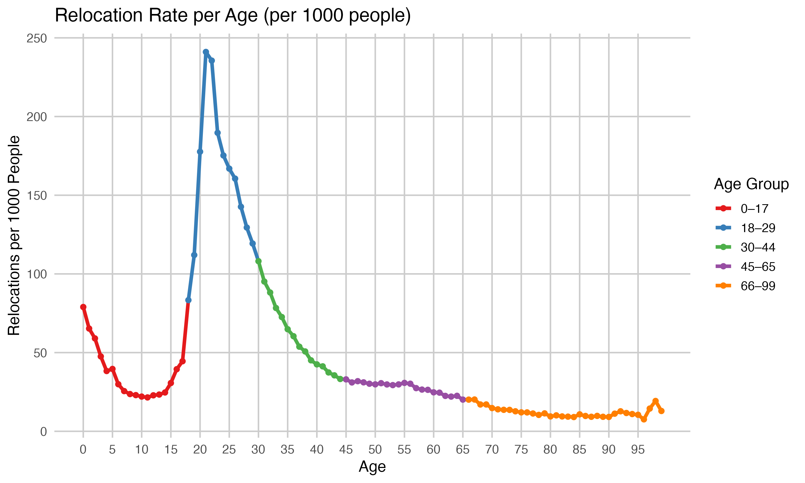
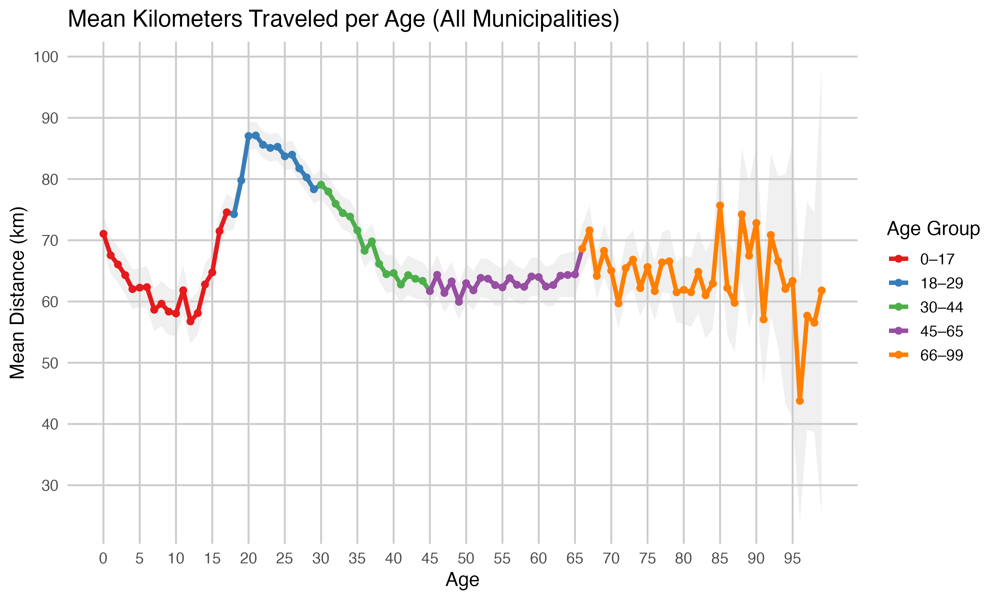
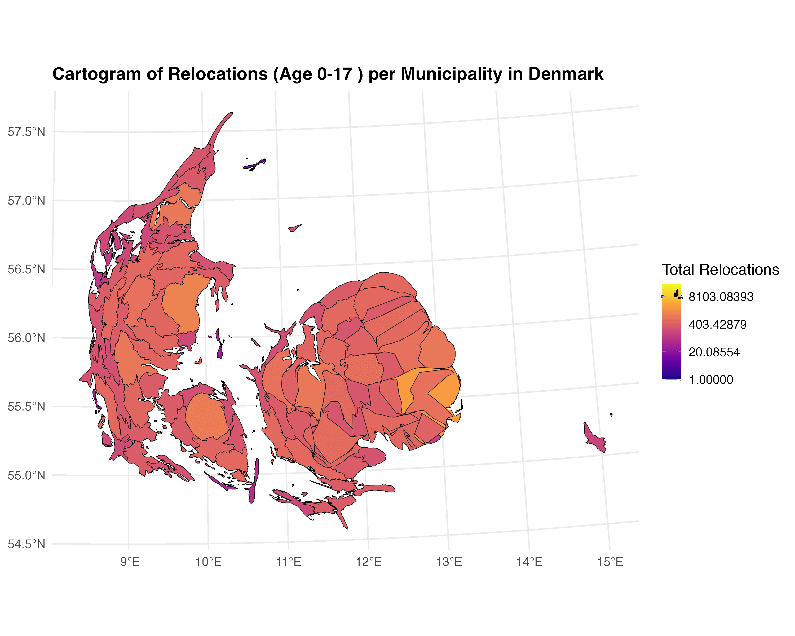
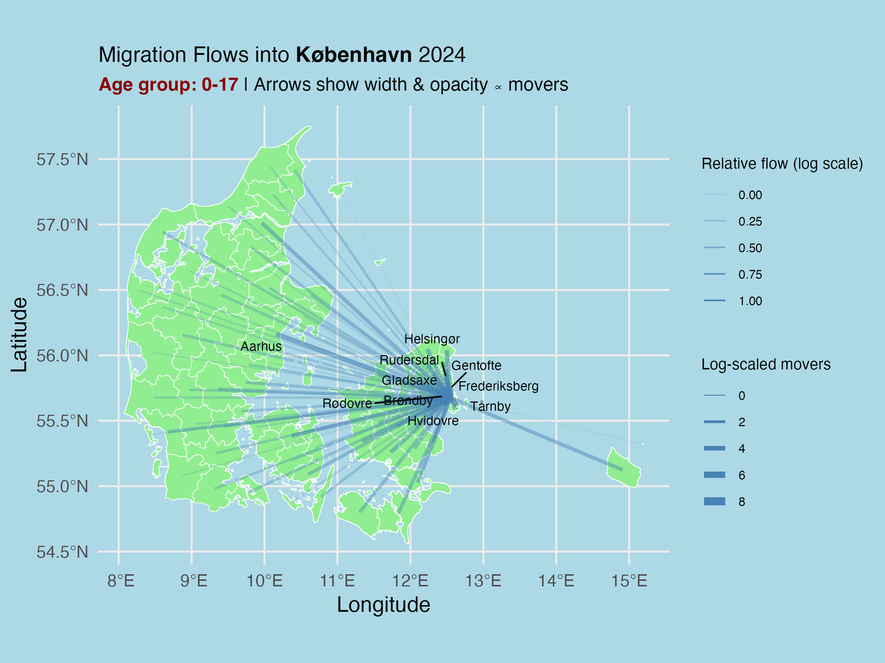
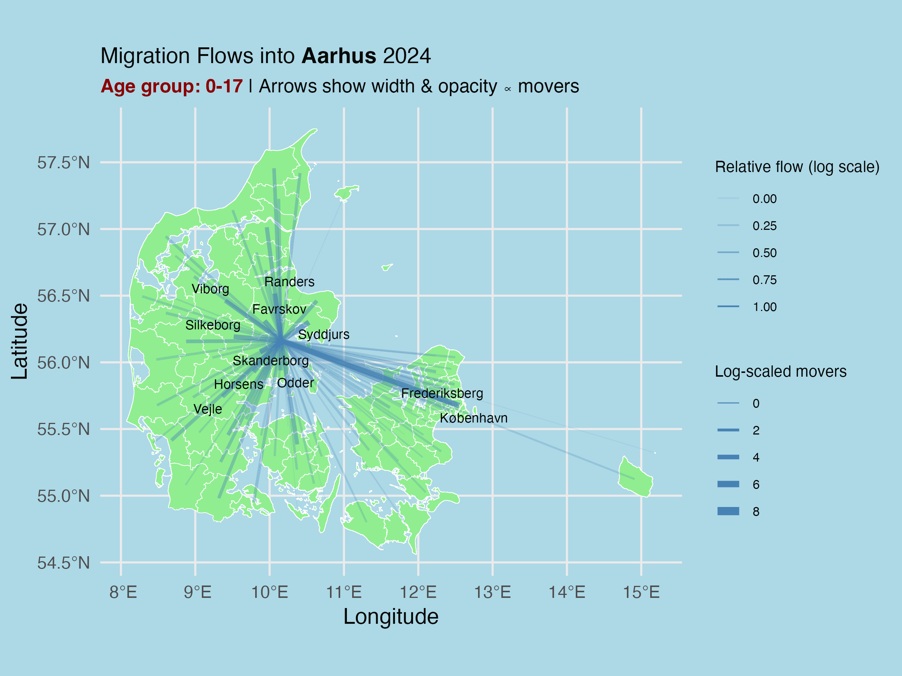
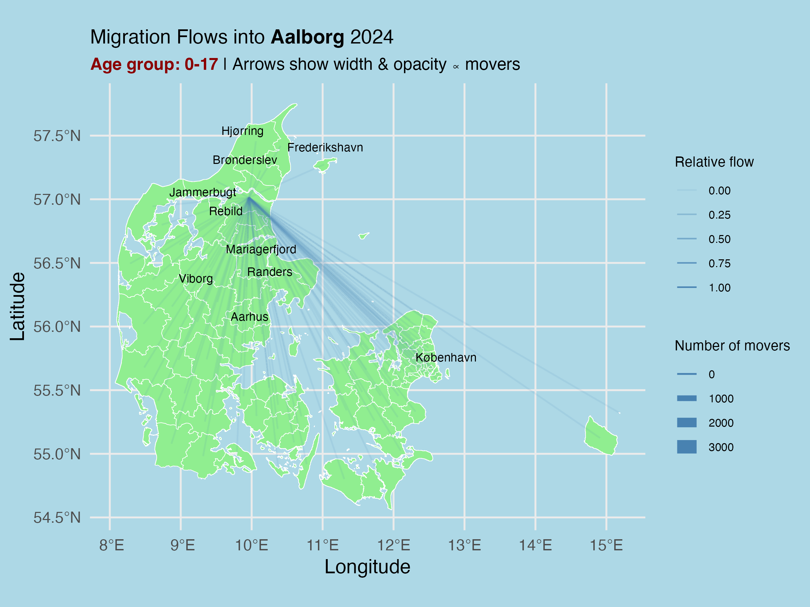
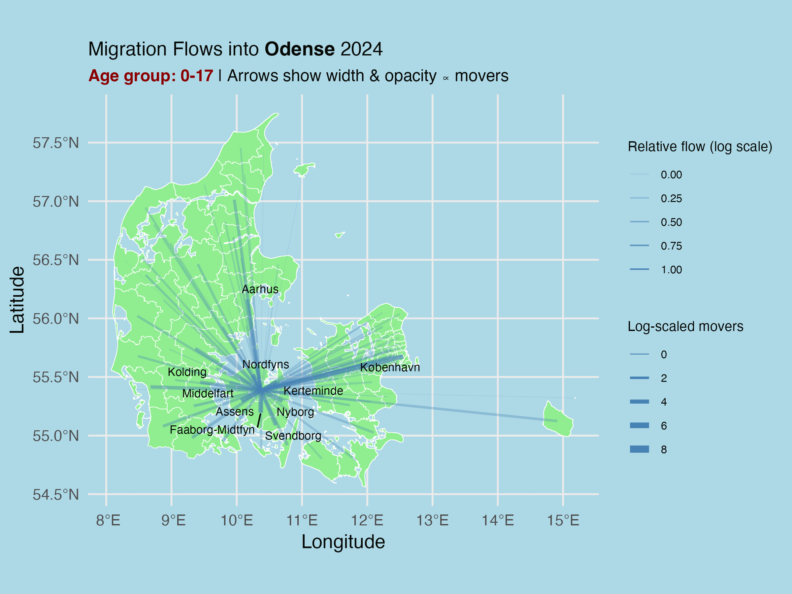

# **An Exploration of Danish Relocation Patterns** 

This repository concerns itself with the analysis of movement patterns in different ages and age groups.

## Structure of 
cds_spatial/
│
├── gadm/              # Folder containing shapefiles and geographic boundaries used in the analysis
│
├── gifs/              # Folder with animated GIFs created for visualizing migration trends
│
├── new_data/          # Folder containing migration data for 2024 and population data of Denmark in Q2024 
│
├── out/               # Folder with analysis outputs such as summary tables and processed files
│
├── analysis_spatial.Rmd     # Main R Markdown script for the spatial analysis
├── analysis_spatial.html    # Rendered HTML version of the final report
├── README.md          # Overview of the project and folder structure

### Relocation Rate
In the paper, we investigate both the relocation rate by age, i.e. how often do different ages relocate as measured in relocations per 1000 people?

### Relocation Distance and Age
An analysis was also conducted in how far people were willing to move and how that differs across lifespan.

### Cartogram of Relocations
Using cartograms, we also investigated which municipalities receive the most movers per age group

### Proportional Popularity Cartogram of Relocations
And creating a popularity cartogram (calculated by total relocations to that municipality per 1000 people in that municipality), we investigated which places are most proportionally popular per age group.

### Flow Maps
Lastly, we also looked at the four biggest municipalities in Denmark, specifically looking at which municipalities people move from when they relocate to these big four.

