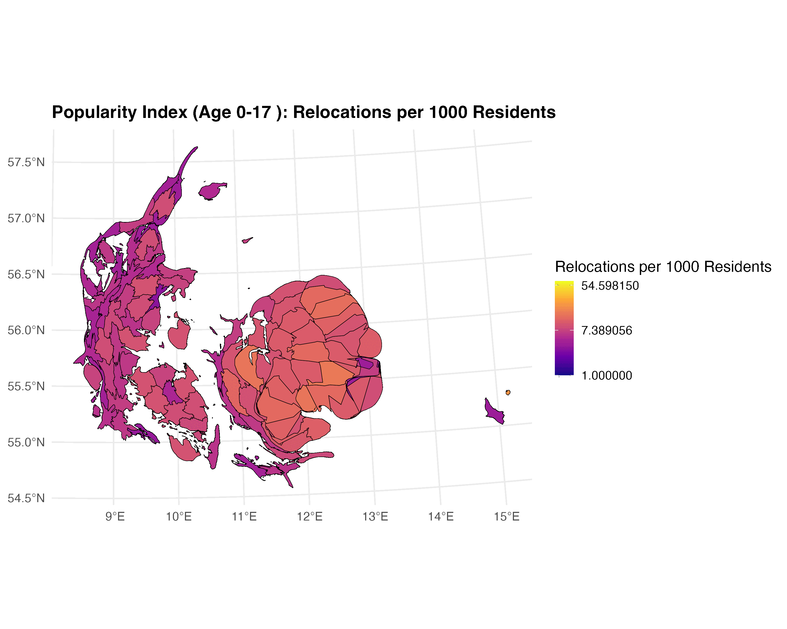

# **An Exploration of Danish Relocation Patterns** 

This project investigates internal relocation patterns in Denmark during 2024, focusing on how often, how far, and where people move across age groups. Using data from Danmarks Statistikbank, we visualize these patterns with line plots, cartograms, and flow maps which highlight migration flows into Denmark’s four largest municipalities.

Our findings show that young adults (18–29) move more frequently and over longer distances, especially toward major cities, while older adults tend to relocate shorter distances, often from neighboring municipalities. These patterns reflect broader life-course dynamics and raise important questions about spatial inequality and urbanization.

## Authors 

  <strong>Villiam Molte Jensen</strong> (<a href="https://github.com/VilliamJ">@VilliamJ</a>) and
  <strong>Kristiane Uhrenholt Warncke</strong> (<a href="https://github.com/KristianeWarncke">@KristianeWarncke</a>)

  Spatial Analytics | Cultural Data Science  
   
  Aarhus University (June 2025)

## Repository Structure

The repository is structured as such:

| Folder/File               | Description                                                                 |
|--------------------------|-----------------------------------------------------------------------------|
| `gadm/`                  | Folder containing shapefiles and geographic boundaries used in the analysis |
| `gifs/`                  | Folder with animated GIFs created for visualizing migration trends          |
| `new_data/`              | Folder containing migration data for 2024 and population data of Denmark in Q2024 |
| `out/`                   | Folder with analysis outputs such as summary tables and processed files     |
| `analysis_spatial.Rmd`   | Main R Markdown script for the spatial analysis                             |
| `analysis_spatial.html`  | Rendered HTML version of the final report                                   |
| `README.md`              | Overview of the project and folder structure                                |

### Relocation Rate
In the paper, we investigate both the relocation rate by age, i.e. how often do different ages relocate as measured in relocations per 1000 people?

### Relocation Distance and Age
An analysis was also conducted in how far people were willing to move and how that differs across lifespan.

### Cartogram of Relocations
Using cartograms, we also investigated which municipalities receive the most movers per age group

### Proportional Popularity Cartogram of Relocations
And creating a popularity cartogram (calculated by total relocations to that municipality per 1000 people in that municipality), we investigated which places are most proportionally popular per age group.

### Flow Maps
Lastly, we also looked at the four biggest municipalities in Denmark, specifically looking at which municipalities people move from when they relocate to these big four.
#### Copenhagen

#### Aarhus

#### Aalborg

#### Odense

