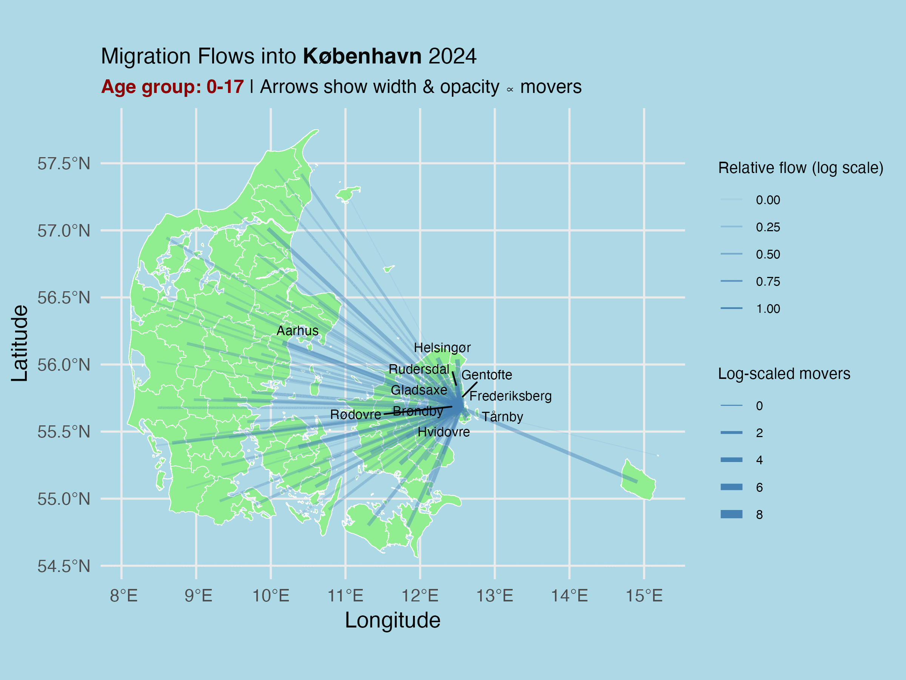
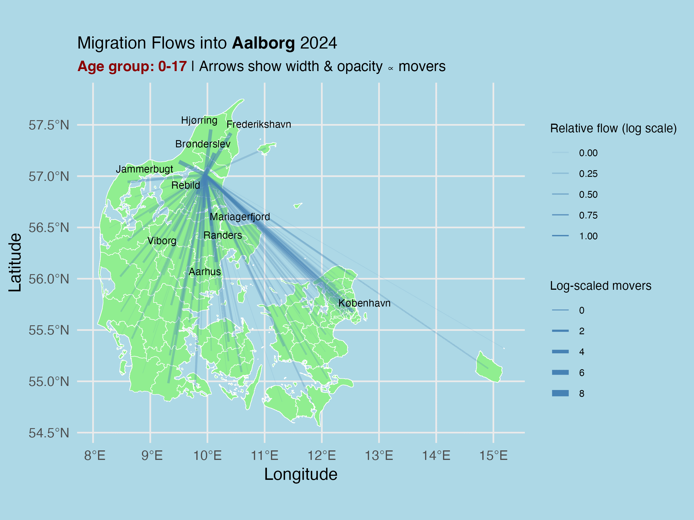

# **An Exploration of Danish Relocation Patterns** 

This repository concerns itself with the analysis of movement patterns in different ages and age groups.

In the paper, we investigate both the relocation rate by age, i.e. how often do different ages relocate as measured in relocations per 1000 people?

An analysis was also conducted in how far people were willing to move and how that differs across lifespan.

Using cartograms, we also investigated which municipalities receive the most movers per age group

And creating a popularity cartogram (calculated by total relocations to that municipality per 1000 people in that municipality), we investigated which places are most proportionally popular per age group.

Lastly, we also looked at the four biggest municipalities in Denmark, specifically looking at which municipalities people move from when they relocate to these big four.

